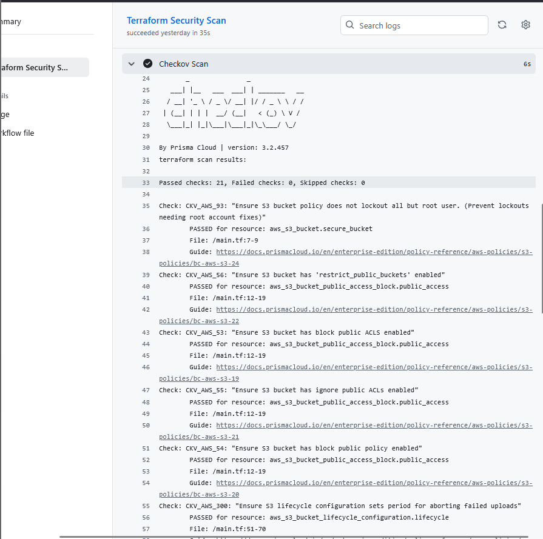
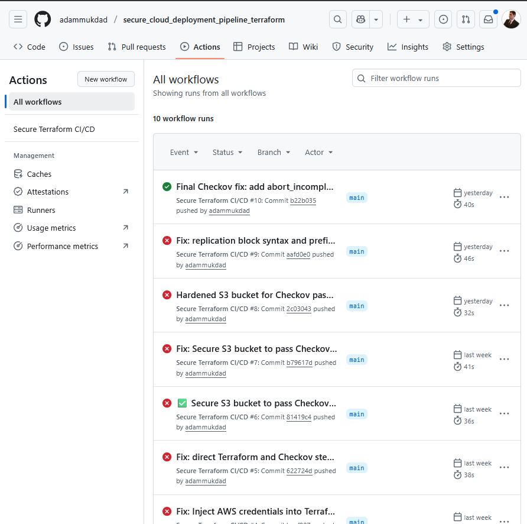
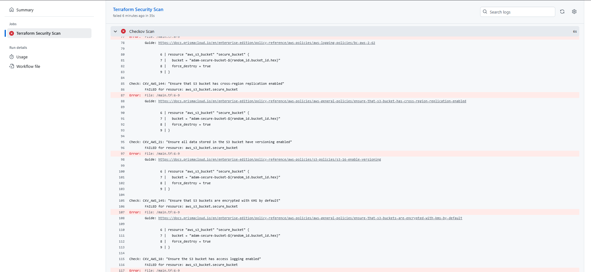

# 🚀 Secure Cloud Deployment Pipeline with Terraform

[](https://www.terraform.io/)
[](https://www.checkov.io/)

[](https://opensource.org/licenses/MIT)

---

## 📄 Overview
This project demonstrates a hardened, scan-gated CI/CD pipeline that securely deploys multi-cloud infrastructure using **Terraform**. It leverages **GitHub Actions** for automation and **Checkov** to enforce security controls pre-deployment, blocking insecure infrastructure-as-code (IaC) before it reaches production.

---

## ✨ Key Features
- Secure AWS S3 bucket provisioning with Terraform
- CI/CD enforcement with GitHub Actions
- Policy-as-code enforcement with Checkov
- Cross-region S3 replication using KMS encryption
- Lifecycle rules and access policies embedded in IaC
- Full security validation before apply stage

---

## 📈 Qualified & Quantified Impact
- ✅ **21 Checkov policies passed**
- ❌ **0 failed security checks**
- ⛔️ Insecure deployments blocked via automated pipeline
- 🔐 KMS-enabled encrypted storage and IAM-restricted access
- 🧪 Validated against CIS and AWS best practices

---

## 🎯 Objectives Met
- Harden S3 bucket using Terraform and enforce versioning, encryption, and access logs
- Block insecure IaC via CI/CD gates with Checkov
- Implement cross-region encrypted replication
- Automatically expire incomplete multipart uploads after 365 days

---

## 🧾 Sample Log Output

```bash
Passed checks: 21, Failed checks: 0, Skipped checks: 0

Check: CKV_AWS_93: "Ensure S3 bucket policy does not lock out all but root user"
PASSED for resource: aws_s3_bucket.secure_bucket
...
Check: CKV_AWS_300: "Ensure S3 lifecycle configuration sets period for aborting failed uploads"
PASSED for resource: aws_s3_bucket_lifecycle_configuration.lifecycle
```

---

## 🧱 Project Structure
```
secure_cloud_deployment_pipeline_terraform/
├── .github/workflows/
│   └── terraform.yml                # CI/CD workflow definition
├── main.tf                          # Terraform configuration
├── variables.tf                     # Input variable declarations
├── outputs.tf                       # Terraform output definitions
├── screenshots/
│   ├── github_actions_workflow_success_checkov_scan_passed.png
│   ├── checkov_scan_passed.png
│   └── checkov_scan_failure_demo.png
└── README.md                        # Project documentation
```

---

## 🛠️ Tech Stack
- **Terraform** v1.8+
- **GitHub Actions** for CI/CD
- **Checkov** v3.2.457 by Bridgecrew
- **AWS S3** for cloud storage and replication
- **IAM** roles and policies for secure access
- **KMS** for encrypted replication

---

## 🧪 How to Run

1. Clone the repo:
   ```bash
   git clone https://github.com/adammukdad/secure_cloud_deployment_pipeline_terraform.git
   cd secure_cloud_deployment_pipeline_terraform
   ```

2. Validate and scan locally (optional):
   ```bash
   terraform init
   terraform validate
   checkov -d .
   ```

3. Push to GitHub — Actions will:
   - Validate Terraform code
   - Run `terraform plan`
   - Perform Checkov scan and block if insecure

---

## 🖼️ Screenshot

✅ **Passing Scan Output**


🟩 **GitHub Actions Success**


❌ **Failure Demo**


---

## 🔭 Future Enhancements
- Add OPA Gatekeeper for deeper policy-as-code enforcement
- Expand to Azure and GCP bucket equivalents
- Introduce drift detection with `terraform plan -detailed-exitcode`
- Auto-approve pull requests that pass security gates

---

## 🧠 Challenges & Lessons Learned
- Terraform's block syntax for S3 replication is strict and sensitive
- Checkov requires precise lifecycle and encryption configuration
- CI/CD pipeline debugging requires iterative commits
- Hardening isn't just functional — it must be policy-compliant too

---

## 🎯 Key Takeaways for Hiring Managers
- This project enforces **fail-fast DevSecOps** best practices
- Highlights strong **IaC security** and **pipeline automation** skills
- Demonstrates ability to secure multi-cloud deployments
- Shows real-world security tooling integration into developer workflows

---

## 👤 Author
**Adam Mukdad**  
📧 [adammukdad97@gmail.com](mailto:adammukdad97@gmail.com)  
🔗 [GitHub Portfolio](https://github.com/adammukdad)  
🔗 [LinkedIn](https://www.linkedin.com/in/adammukdad/)

🕒 Drafted on August 03, 2025
